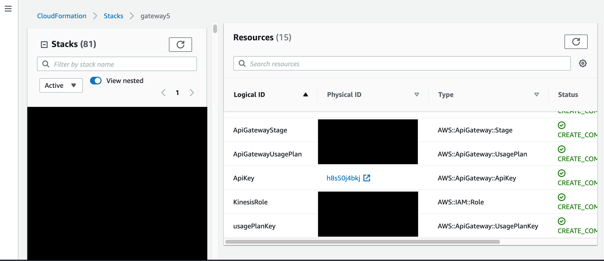

Log in to your AWS account. In AWS console select Cloudformation. Select the stack that you created. Click on "Resources" in the right pane :

You should find clickable links for resources named "ApiGatewayRestApi" and "ApiKey". If you click on the physical ID of "ApiKey".

Click on "Show". Make note of the API key that is displayed to you. Back in cloudformation, if you click on the physical ID of "ApiGatewayRestApi":

Make note of the "Invoke URL" field. Replace the {stream-name} part in the url string with the name of the kinesis stream to send data to. 

Paste the API key and endpoint url into the appropriate fields in Constants.swift file. 
